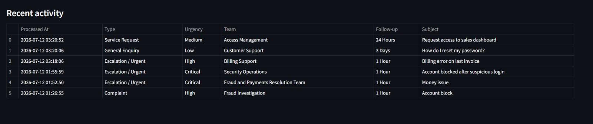

# AI Request Processing Prototype

## 1. Overview
This prototype implements an AI-powered request intake and remediation workflow for incoming customer requests. It supports:

- manual request entry via form
- request upload with `*.txt` files
- AI classification into request type and urgency
- branch-specific remediation actions and a draft customer response
- request logging and recent activity history

The delivered solution follows the attached submission requirements: classification, remediation branches, downstream actions, and readable outputs for operations.

## 2. Repository contents
- `app.py` — Streamlit application and UI
- `workflow.py` — orchestration of classification, remediation, and logging
- `ai.py` — AI prompt logic for classification and response generation
- `logger.py` — persistence of processed requests to `request_log.json`
- `request_log.json` — stored request history created at runtime
- `UploadFileTest.txt` — sample upload request file
- `requirements.txt` — Python dependencies
- `presentation_outline.md` — five-slide summary deck content
- `workflow_export.json` — workflow branch and remediation export

## 3. Setup instructions
1. Create a Python virtual environment and activate it.

   ```powershell
   python -m venv venv
   .\venv\Scripts\Activate.ps1
   ```

2. Install dependencies:

   ```powershell
   pip install -r requirements.txt
   ```

3. Create a `.env` file in the project root with your OpenAI API key:

   ```text
   OPENAI_API_KEY=your_api_key_here
   OPENAI_MODEL=gpt-4.1-mini
   ```

4. Run the app:

   ```powershell
   streamlit run app.py
   ```

## 4. Test upload input
Upload files must be plain text files with extension `.txt`.

The expected format is:
- first line = subject
- remaining lines = request description

Example `UploadFileTest.txt`:

```
Account blocked after suspicious login
My account was locked after I saw unknown activity. Please check and escalate as urgent.
```

If the uploaded file contains only a single line, that line is treated as the request text.

## 5. Workflow design
The prototype follows this flow:

1. receive request (manual form or text upload)
2. AI classification into branch and urgency
3. branch-specific remediation planning
4. generate an operational summary and customer draft response
5. log the request and show history

### Branches supported
- `Complaint`
- `General Enquiry`
- `Service Request`
- `Escalation / Urgent`

### Example remediation logic
- Complaint: acknowledgement, escalate, priority logging, follow-up reminder
- General Enquiry: answer, route to knowledge base or team, close
- Service Request: confirm details, assign team, schedule delivery
- Escalation / Urgent: supervisor alert, human review, pause auto-resolution

## 6. Output format
For each request processed, the app produces:

- request type label
- urgency level
- assigned team
- follow-up timeline
- branch-specific action summary
- draft customer response
- recent processed request history

## 6.1 Screenshot example


## 7. Sample inputs
Here are sample requests for each branch:

### Complaint
Subject: Billing error on account
Description: I was billed twice for last month. I need this corrected immediately and want a higher priority review.

### General Enquiry
Subject: How do I reset my password?
Description: I want to know the steps to reset my portal password and whether there is any MFA requirement.

### Service Request
Subject: Request account access change
Description: Please update my account permissions to include access to the sales reporting dashboard.

### Escalation / Urgent
Subject: Critical security incident report
Description: I see unauthorized transactions and the account is locked. Please escalate to human review and treat as urgent.

## 8. Deployment notes
This solution can be deployed to any Python host capable of running Streamlit, including Streamlit Cloud, Render, or Railway.

The app currently depends on:
- `streamlit`
- `openai`
- `python-dotenv`

## 9. Optional enhancements
Potential next steps if more time is available:
- support batch request upload via CSV or JSON
- add a dashboard with request volume by branch and urgency
- add confidence or human-review override controls
- store logs in a database instead of JSON
